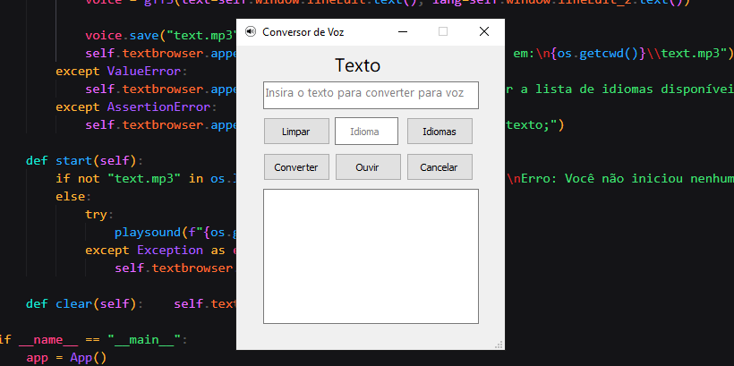

# Sobre 
Esse programa foi feito com foco no meu aprendizado na biblioteca PyQt5, é um programa básico com a função de converter o texto digitado pelo usuário em voz. 
**Bibliotecas usadas: `PyQt5, gtts e playsound`**

# Layout do Programa
 
**O layout/interface foi feito usando o QtDesigner:** <a href="https://build-system.fman.io/qt-designer-download">Download</a>
